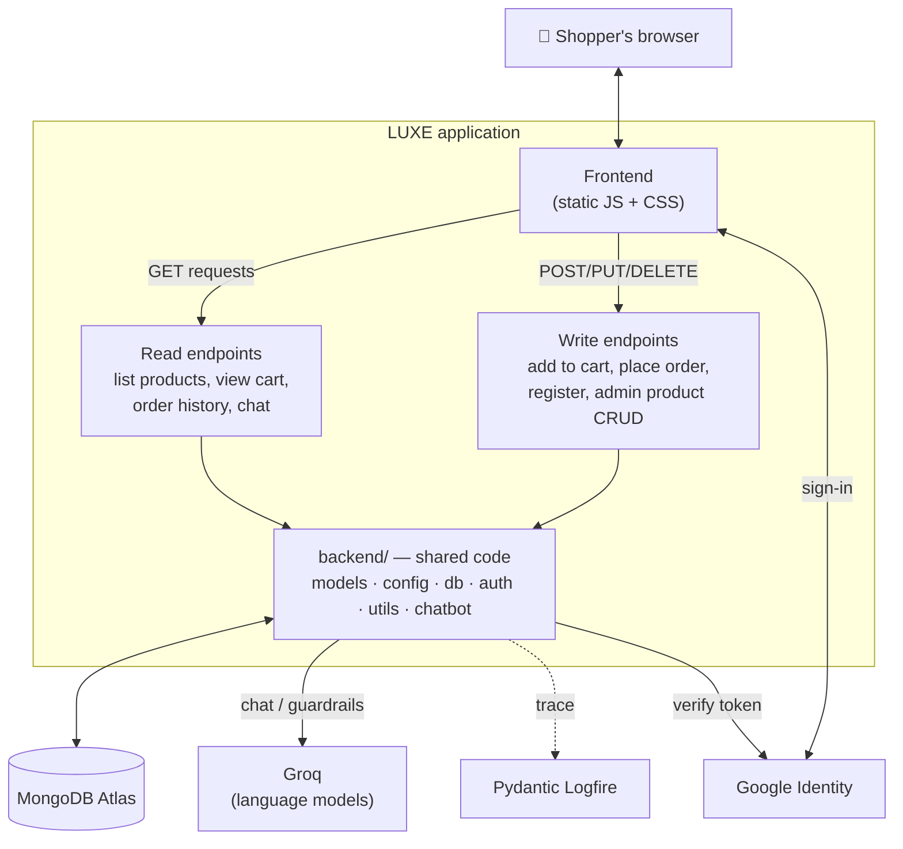
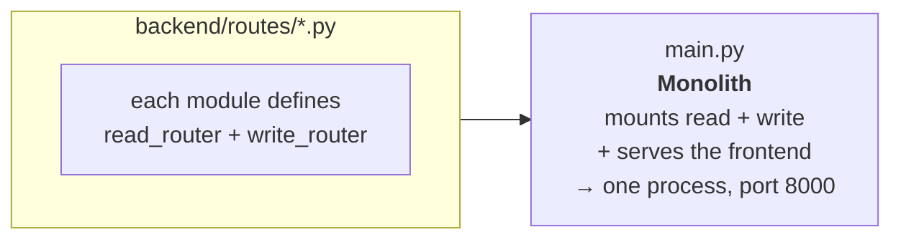
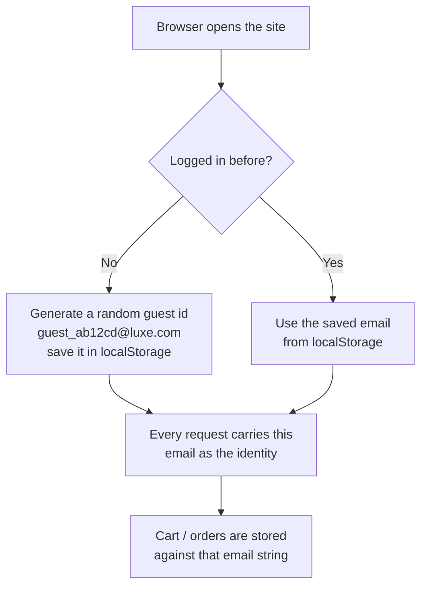
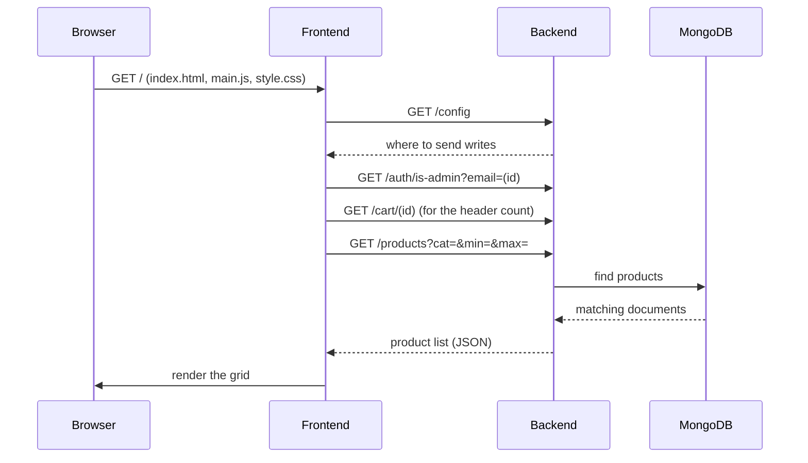
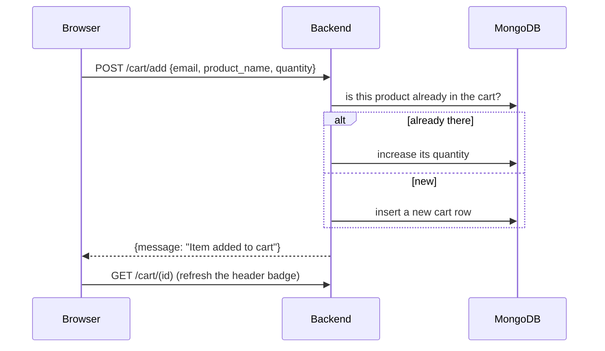
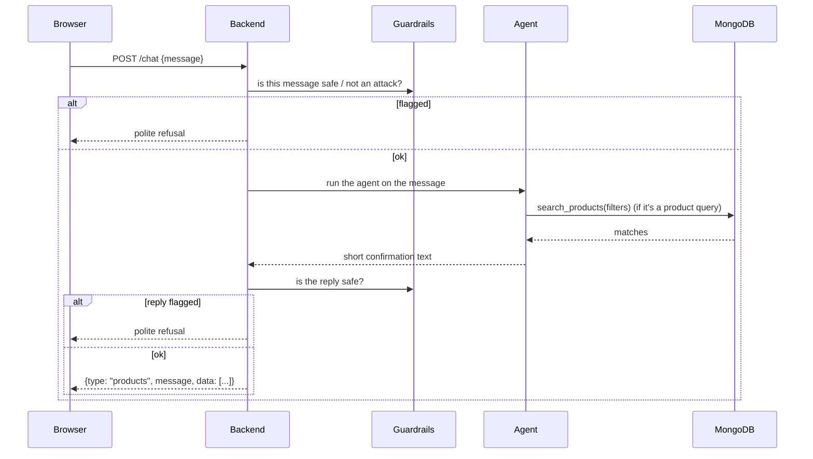

# 2 · Architecture

## The big picture



Everything the shopper sees is the **frontend**. It only knows how to make small
JSON requests. All the logic lives in the **backend**, which is the only thing
that talks to the database and to Groq.

The backend's endpoints fall into two groups:

- **Reads** — anything that only *looks at* data: listing products, viewing one
  product, reading a cart, reading order history, and the chatbot (it only
  queries the database, it never changes it).
- **Writes** — anything that *changes* data: adding to a cart, placing an order,
  registering / logging in, editing a profile, and all the admin product
  operations.

Both groups are backed by the **same Python functions** in `backend/`. The
split is only about *which endpoints are mounted where* — see the next section.

## One entry point, reads and writes side by side



```bash
python main.py
```

One FastAPI process on **port 8000** that serves the frontend *and* every API
endpoint, including the chatbot. The frontend asks the backend where to send
"write" requests (via a tiny `GET /config` endpoint); the monolith answers
"same place as everything else."

> New endpoints are added in one place: a decorator on `read_router` or
> `write_router` inside the relevant `backend/routes/*.py` module — `main.py`
> mounts both automatically.

## Identity — how the app knows who you are

LUXE keeps this deliberately simple. There are **no session tokens**.



- A **guest** gets a random `guest_…@luxe.com` id stored in the browser. Their
  cart and orders are tied to that string.
- **Registering or signing in** replaces the guest id with a real email. From
  then on the cart and orders follow the real email.
- **Admin** actions send the user's email in an `X-User-Email` header; the
  backend checks an `is_admin` flag on that user's database document. This is a
  convenience gate for a demo, not a security boundary.

Passwords are hashed with **bcrypt** before storage. "Sign in with Google"
works differently: Google gives the browser a signed token, the backend
verifies Google's signature (using the `google-auth` library), and trusts the
email inside — no password involved.

## What happens on a request — three walkthroughs

### Loading the home page



### Adding to the cart



### Asking the assistant

See [AI Assistant](06-ai-assistant.md) for the full version. Short form:


