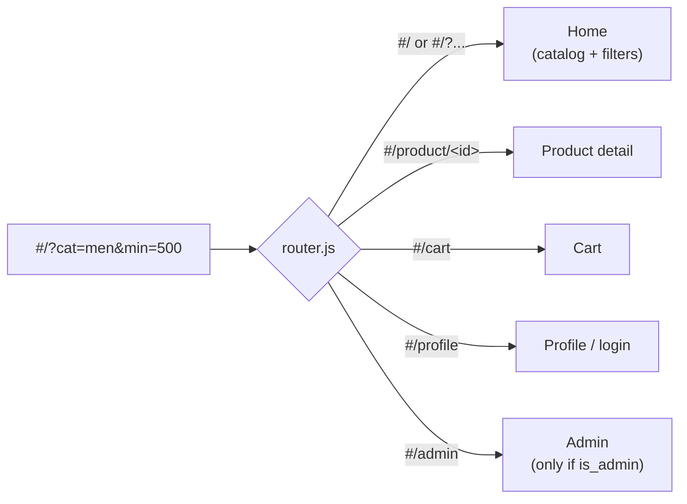

# 3 · Frontend

The frontend is the storefront — the part running in the shopper's browser.
It is **plain JavaScript**, split into small ES‑module files. The browser loads
the files exactly as they are on disk; there is no build step, no framework, no
`node_modules`.

## What the browser loads

```
Frontend/
  index.html          the page shell — three empty boxes + one <script>
  src/
    main.js           startup: mount the shell, then route
    router.js         reads the URL, shows the right page
    style.css         all styling
    components/       reusable UI: Header, Hero, Chatbot
    pages/            one file per screen: Home, ProductDetail, Cart, Profile, Admin
    services/         everything that is not UI: state, API calls, navigation
    utils/            tiny helpers: escapeHtml, image placeholder
```

`index.html` is almost empty on purpose:

```html
<div id="site-header"></div>   <!-- the top bar, filled by mountHeader()   -->
<main id="app"></main>          <!-- the current page, filled by the router  -->
<div id="chatbot-root"></div>   <!-- the chat widget, filled by mountChatbot() -->
```

The header and the chatbot are mounted **once** and stay put. Navigation only
replaces the contents of `<main id="app">`.

## Routing — the URL is the state

The app uses **hash routing**: everything after the `#` in the address bar
decides what is shown. Nothing is loaded from the server on navigation — it is
all client‑side.



Two important consequences:

- The **catalog view lives entirely in the URL**: category and price range are
  query parameters. That means the browser **Back** button works, and a filtered
  view can be bookmarked or shared.
- When you change category or price, the code just calls `navigate('#/?cat=…')`.
  The router notices the URL changed and re‑renders the Home page from it.

## Rendering — build a string, set `innerHTML`

Each page is a function that:

1. fetches whatever data it needs,
2. builds an HTML string with a template literal,
3. sets `document.getElementById('app').innerHTML = …`,
4. attaches event listeners to the fresh elements.

Any value that came from the database or the user is passed through
**`escapeHtml()`** first, so a product description containing `<` or `"` can
never break the page or inject markup.

## The services layer

UI files never call `fetch` directly. Everything goes through `services/`:

| File | Responsibility |
|------|----------------|
| `services/state.js` | One plain object, `state`, holding everything the UI needs to remember: the session email, `isAdmin`, the cart count, the current category, chat messages, the admin form draft. Plus `login()` / `logout()` helpers that also update `localStorage`. |
| `services/nav.js` | `navigate(hash)` and `currentRoute()` — the only place the URL hash is read or written. |
| `services/api/http.js` | **`request()`** — the single wrapper around `fetch`. It picks the right base URL (reads → same origin, writes → the ingestion service), sends the body as JSON or FormData, checks the response, and **throws `Error(<message from the backend>)`** on any failure. |
| `services/api/*.js` | One small module per area (`auth`, `products`, `cart`, `orders`, `chat`). Each function is one line: call `request()` with the right path. |
| `services/api_v2.js` | A "barrel" that re‑exports all the API functions, so pages can `import { fetchProducts, addToCart } from '../services/api_v2.js'`. |
| `services/cartCount.js` | The **only** place `state.cartItemCount` is written. `refreshCartCount()` fetches the cart, sums the quantities, and repaints the header. |
| `services/cartActions.js` | The shared "Add to Cart" button behaviour used by both the grid and the product page. |

### Why one `request()` function matters

Every network error looks the same to the user: an alert with the backend's own
message ("Admin access required", "That username is already taken", …). Pages
just do:

```js
try {
  await addProduct(formData);
  alert('Product added ✅');
} catch (err) {
  alert(`Failed to add product: ${err.message}`);
}
```

## The pages

| Page | What it does |
|------|--------------|
| **Home** (`pages/Home.js`) | The hero banner, the price‑filter bar, and the product grid. Reads category + price from the URL, fetches `GET /products`, renders cards. Clicking a card opens the product; clicking "Add to Cart" calls the shared cart action. |
| **Product detail** (`pages/ProductDetail.js`) | Fetches one product with `GET /products/{id}`. Shows sizes/colours, "Add to Cart" and "Buy Now". If the id is unknown, shows a friendly "couldn't find that product" screen. |
| **Cart** (`pages/Cart.js`) | Fetches the cart and the catalog in parallel, joins them for prices/images, shows the total. "Clear Cart" empties it; "Buy All Now" places one order per line then clears the cart. |
| **Profile** (`pages/Profile.js` + `pages/profile/*`) | Logged out: login / register forms + the Google button. Logged in: avatar upload, an "Edit Profile" panel (needs the current password), order history, and a "Danger Zone" to delete the account. |
| **Admin** (`pages/Admin.js` + `pages/admin/*`) | Only reachable when `state.isAdmin` is true. Add/edit a product form, a product list with Edit/Delete, a "Delete All" button, and the Excel + zip bulk importer. |

## The chatbot widget

`components/Chatbot.js` lives in `#chatbot-root`, so it is available on **every**
page. Its state (open/closed, messages, the text being typed) is in the shared
`state` object. When something changes it re‑renders **only itself** — it does
not touch the rest of the page. Product cards inside a chat reply are clickable
and open the product page.
