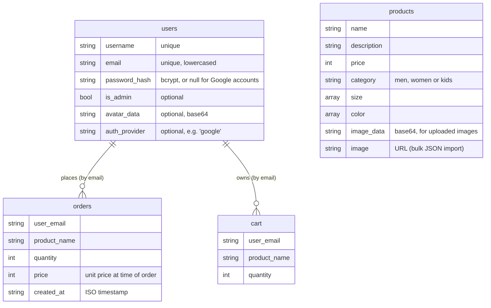

# 5 · Database

## MongoDB's role

MongoDB is the **single source of truth** for everything the app remembers:
products, shopping carts, orders, and user accounts. Nothing is stored on disk
in the app itself — even product images live in the database (as base64 text).

The app uses **MongoDB Atlas**, the managed cloud version of MongoDB. The
connection string is the `MONGO_URI` setting; the database name is
`ecommerce_db`.

### Why a document database?

MongoDB stores each record as a **document** — a JSON‑like object — instead of a
row in a fixed table. That fits this project well:

- A product may or may not list colours. A document simply has or doesn't have
  that key; there is no "NULL column" to design around.
- A product's image can be stored two different ways (an uploaded file as
  base64, or a plain URL from a bulk import). The same collection holds both
  shapes.
- There is no need for joins: a cart item just stores the product's **name**,
  and the frontend looks up the price/image from the product list it already
  has.

## The four collections



There are **no hard foreign keys**. Carts and orders are linked to a user by
storing the user's **email string**, and to a product by storing the product's
**name string**.

### `users`

```json
{
  "username": "aanand",
  "email": "aanand@example.com",
  "password_hash": "$2b$12$....",     // bcrypt; null if the account is Google-only
  "is_admin": true,                   // present only for admins
  "avatar_data": "iVBORw0KGgo...",    // base64, present only if an avatar was uploaded
  "avatar_content_type": "image/png",
  "auth_provider": "google"           // present only for Google sign-ups
}
```

Two **unique indexes** are created on startup: one on `email`, one on
`username`. They stop two accounts from sharing either.

### `products`

```json
{
  "name": "Classic Black Tee",
  "description": "Soft combed-cotton crew neck",
  "price": 799,
  "category": "men",
  "size":  ["S", "M", "L", "XL"],
  "color": ["Black"],
  "image_data": "/9j/4AAQSkZJRg...",       // base64, for admin-uploaded images
  "image_content_type": "image/jpeg"
}
```

A product imported via `POST /products/bulk` (JSON) instead has a plain
`"image": "https://…"` URL and no `image_data`.

When the API returns a product it **converts** MongoDB's internal `_id` into a
string field called `id`, and rebuilds the image into a single `image` value
(either the URL, or a `data:image/…;base64,…` string) so the frontend only ever
deals with one `image` field.

### `orders`

```json
{
  "user_email": "aanand@example.com",
  "product_name": "Classic Black Tee",
  "quantity": 2,
  "price": 799,
  "created_at": "2026-01-15T10:32:00+00:00"
}
```

One document per line item. "Buy All Now" in the cart writes several of these.

### `cart`

```json
{
  "user_email": "guest_ab12cd@luxe.com",
  "product_name": "Classic Black Tee",
  "quantity": 1
}
```

Adding the same product again **increments `quantity`** on the existing
document rather than inserting a second one. Checkout deletes every cart
document for that email.

## In tests

The test suite never touches Atlas. `tests/conftest.py` replaces each collection
handle with a small in‑memory fake that implements just enough of the MongoDB
API (`find`, `find_one`, `insert_one`, `update_one` with `$set` / `$inc`,
`delete_*`). Tests run offline, instantly, and for free.
