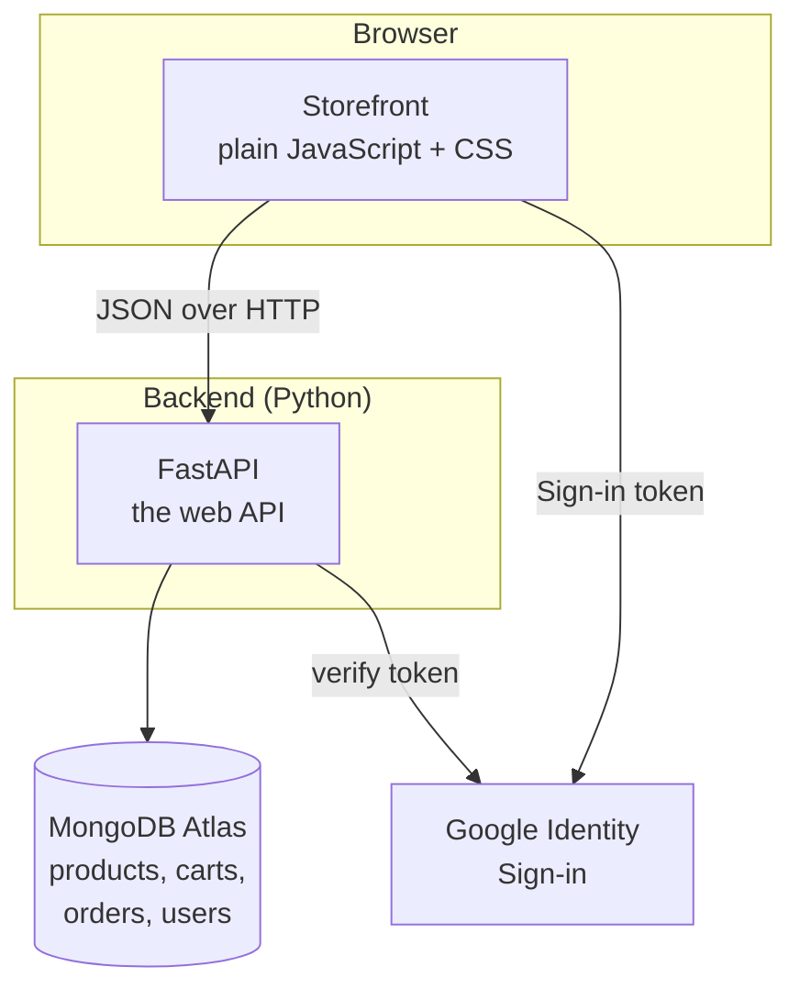

# 1 · Overview

## What is LUXE?

LUXE is a small but complete e‑commerce website for a clothing brand. A visitor
can:

- Browse products in three categories: **Men, Women, Kids**.
- Filter the catalog by a **price range**.
- Open any product to see its description, sizes and colours.
- **Add to cart** and **place an order**. There is no checkout form — an order
  is identified by an email address (a real one if you signed in, an
  auto‑generated "guest" one if you didn't).
- **Create an account** with email + password, or **sign in with Google**.
- Edit their profile, upload an avatar, view past orders, or delete the account.

There is also an **admin** view (for a store owner) to add, edit and delete
products, including a bulk upload from an Excel sheet + a zip of images.

## Why it is built this way

| Goal | How the project meets it |
|------|--------------------------|
| **Load instantly, no build step** | The storefront is plain JavaScript served as‑is. There is no bundler, no `npm build`, nothing to compile. |
| **Flexible product data** | Products have optional fields (sizes, colours). A document database (MongoDB) stores each product as a JSON‑like document, so a product without a "colour" simply doesn't have that key. |
| **One codebase, two ways to run** | The same route functions back a single monolith process *and* a split reads/writes deployment — see [Architecture](02-architecture.md). |
| **Deploy without servers to manage** | The app runs on Google Cloud Run, which starts containers on demand and scales to zero when idle. |

## Technology stack

| Layer | Technology | In one sentence |
|-------|------------|-----------------|
| **Storefront** | Vanilla JavaScript (ES modules), CSS | The pages the shopper sees; the browser loads the exact files on disk. |
| **Web framework** | FastAPI (Python) | Receives HTTP requests, runs the matching Python function, returns JSON. |
| **Data models** | Pydantic | Describes the shape of every request body and rejects malformed data automatically. |
| **Configuration** | pydantic‑settings | One typed object holding every setting, read from environment variables / a `.env` file. |
| **Database** | MongoDB Atlas | A cloud document database. Stores products, carts, orders and user accounts. |
| **Password hashing** | bcrypt | Turns a password into a one‑way hash before it is stored. |
| **Google Sign‑In** | Google Identity Services + `google-auth` | The browser gets a signed token from Google; the backend verifies the signature. |
| **Spreadsheet import** | openpyxl | Reads the `.xlsx` file in the admin bulk‑upload. |
| **Containers** | Docker | Packages the app so it runs the same everywhere. |
| **Hosting** | Google Cloud Run | Runs the container; see [Deployment](06-deployment.md). |
| **CI/CD** | Google Cloud Build | On every push: build the Docker image and deploy to Cloud Run. |

## What each external service is responsible for

- **MongoDB Atlas** — the single source of truth for all data. See [Database](05-database.md).
- **Google Identity Services** — issues the sign‑in token the "Sign in with
  Google" button produces.
- **Google Cloud** — hosts the running app. See [Deployment](06-deployment.md).
