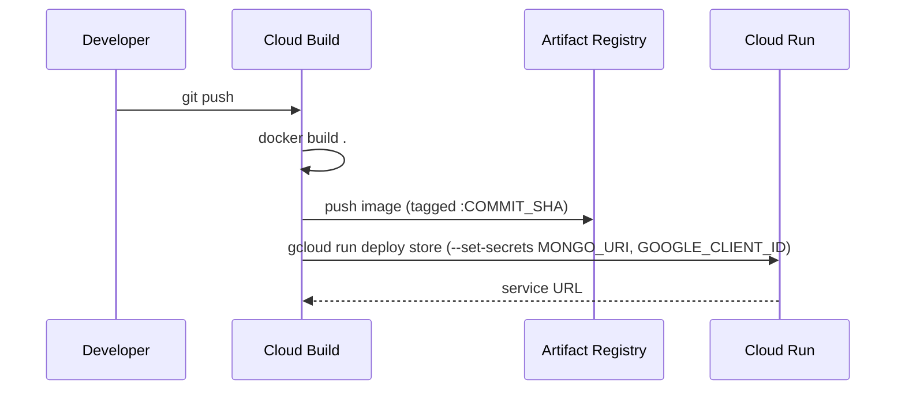

# 6 · Deployment

In production, LUXE runs on **Google Cloud** as a single container on Cloud
Run, built and deployed automatically by **Google Cloud Build** on every push
to this branch.

For the step‑by‑step "set up the Google Cloud project" commands, see
[`commands.md`](../commands.md) in the repo root. This page explains *what* is
used and *why*.

## Google Cloud services used

| Service | What it does here |
|---------|-------------------|
| **Cloud Build** | Builds the Docker image and runs the deploy step, defined in [`cloudbuild.yaml`](../cloudbuild.yaml) at the repo root. A Cloud Build trigger connected to this repo runs it automatically on every push. |
| **Cloud Run** | Runs the container as a single service (`store`). Fully managed: no VMs to patch, scales up under load, scales to **zero** when idle (you pay per request). Gets a public HTTPS URL. |
| **Artifact Registry** | A private Docker image store — the pipeline pushes the built image here, tagged with the Git commit hash, in a repository called `store-repo`. |
| **Secret Manager** | Holds `MONGO_URI` and `GOOGLE_CLIENT_ID`. `cloudbuild.yaml`'s `--set-secrets` maps them into the container as environment variables — nothing sensitive sits in a committed file. |

**Region:** `asia-south1` (Mumbai) — matches MongoDB Atlas's own region, so the
app and the database aren't paying a cross-continent round trip on every query.

**MongoDB Atlas is not a Google Cloud service.** It is a managed database from
MongoDB Inc. The app reaches it over the internet using `MONGO_URI`.

## The container image

One image, built from the repo-root `Dockerfile`, running the **monolith**
(`main.py` — the storefront and every API endpoint, in one process, port
8000). This branch ships that single entry point only.

## The pipeline

`cloudbuild.yaml`, triggered by a push:



## Secrets the pipeline needs

Stored in **Secret Manager**, not the repo — `cloudbuild.yaml` reads them at
deploy time via `--set-secrets`:

| Secret | Purpose |
|--------|---------|
| `MONGO_URI` | database connection |
| `GOOGLE_CLIENT_ID` | Google Sign‑In |

To rotate a value (e.g. after changing the DB password): open the secret in
Secret Manager, add a new version, then re-run the Cloud Build trigger so the
next deploy picks up `:latest`.

## Running it yourself without Google Cloud

```bash
python main.py   # one process, everything on port 8000
```

Reads configuration from a `.env` file (copy `.env.example`).
